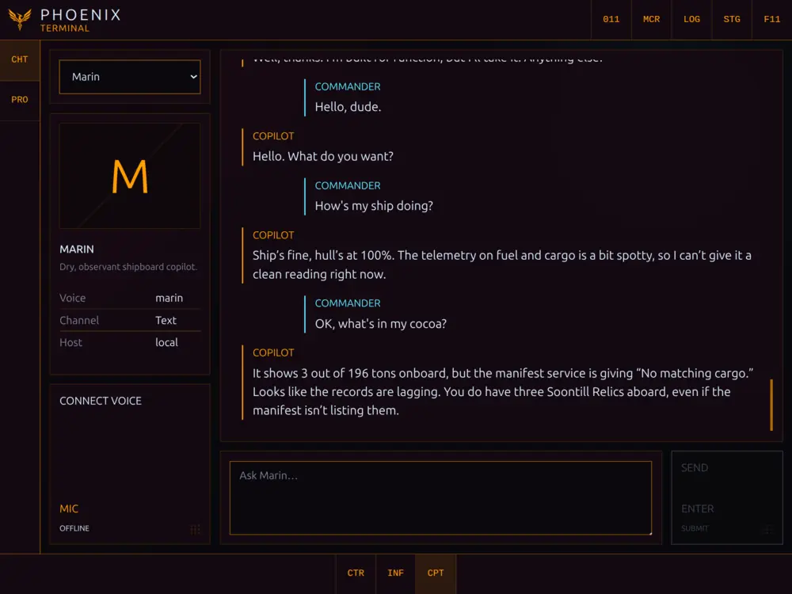

# PHOENIX

> **Work in progress:** PHOENIX is under active development and is not ready for public use—or unsupervised operation of suspiciously red buttons.

PHOENIX is a local-first companion application and ship-computer interface for Elite Dangerous. It turns live telemetry, journal history, control bindings, public galaxy data, and an optional AI Copilot into one cockpit for desktop, tablet, and auxiliary displays.





## Current status

PHOENIX currently supports **manual installation on Linux only**. There is no installer or launcher
yet, but on the supported Linux setup the application and its currently supported feature set are
functional as intended.

PHOENIX has so far been visually optimized and reviewed only for **Chrome on an Android tablet**.
Desktop layouts, other browsers, and other devices may work, but have not received the same visual
verification.

Telemetry ingestion, journal reconstruction, and external data integrations are operational, but
their data quality and completeness still need broader verification against real commander history
and gameplay. PHOENIX preserves unknowns rather than presenting unverified conclusions as facts.

## Implemented features

- **Customizable control deck:** remotely control the ship and Elite Dangerous interface using the
  commander's real bindings. Arrange commands freely, record reusable macros, and keep dangerous
  actions visibly distinct.
- **Commander and ship information:** inspect live and reconstructed commander state, ships, fleet,
  cargo, engineering, missions, communications, navigation, exploration, and journal history.
- **Galaxy and cartography tools:** use symbolic system cartography, plotted-route views, and galaxy
  queries for systems, stations, shipyards, outfitting, markets, factions, and community-sourced
  intelligence.
- **Customizable AI Copilot:** create distinct Copilot profiles and converse through persistent text
  chat or realtime voice. The Copilot can query PHOENIX and configured external data sources, reason
  over live commander context, navigate the application across connected displays, and—with
  explicit permission—operate configured controls and macros. It can also just chat, which is
  occasionally safer for everyone involved.
- **Numpad command shortcuts:** assign commands and application destinations to memorable
  Numpad sequences. Navigate PHOENIX or issue controls without hunting through menus, because muscle
  memory is how you survive a pirate ambush.
- **Coordinated multi-device cockpit:** pair browsers, synchronize display commands, choose which
  screen follows Copilot navigation, and coordinate the active voice host without turning every
  connected display into the same screen.

## Next steps

1. Add and verify Windows support, including Elite discovery and native game controls.
2. Provide proper installers for Linux and Windows.
3. Continue improving the tablet interface first.
4. Adapt and visually verify the interface for desktop and other auxiliary displays.

## Feedback and contributions

PHOENIX is not accepting code contributions or pull requests before its first release. Keeping the
implementation under one maintainer for now helps the code and architecture remain coherent while
the foundations settle. It also leaves room to prioritize the features that matter during actual
gameplay—even if considerably more time is currently spent building the cockpit than flying the
ship.

Bug reports, constructive criticism, and feature requests are very welcome. Feel free to open an
issue—real-world use cases and detailed reports are especially useful. See
[CONTRIB.md](CONTRIB.md) for the current contribution and licensing policy.

## License

PHOENIX is source-available under the [PolyForm Strict License 1.0.0](LICENSE). Personal and other
noncommercial use is permitted while redistribution and modified versions are restricted; the
license text itself is authoritative. This deliberately conservative prerelease license may be
relaxed for future versions once the project's long-term distribution model is settled.

The development source remains available for manual installation without charge. Official packaged
releases may later be offered separately through platforms such as Steam, primarily to provide
convenient installation and automatic updates.

Development currently targets Node.js 24.14+:

```sh
npm install
npm run dev
```

Open `http://localhost:3401` to access the development application. To build and serve the
production application on `http://localhost:3400`:

```sh
npm run build
npm start
```

Copilot is optional and uses `PHOENIX_OPENAI_API_KEY` or `OPENAI_API_KEY` when configured. See
[`.env.example`](.env.example) for ports, paths, models, input backends, and other overrides.

Expect breaking changes and no installation support yet. PHOENIX reports unknown data as unknown
and distinguishes “command sent” from “ship definitely did the thing.”


