# PHOENIX

> **Work in progress:** PHOENIX is under active development and is not ready for public use—or unsupervised operation of suspiciously red buttons.

PHOENIX is a local-first companion application and ship-computer interface for Elite Dangerous. It turns live telemetry, journal history, control bindings, public galaxy data, and an optional AI Copilot into one cockpit for desktop, tablet, and auxiliary displays.


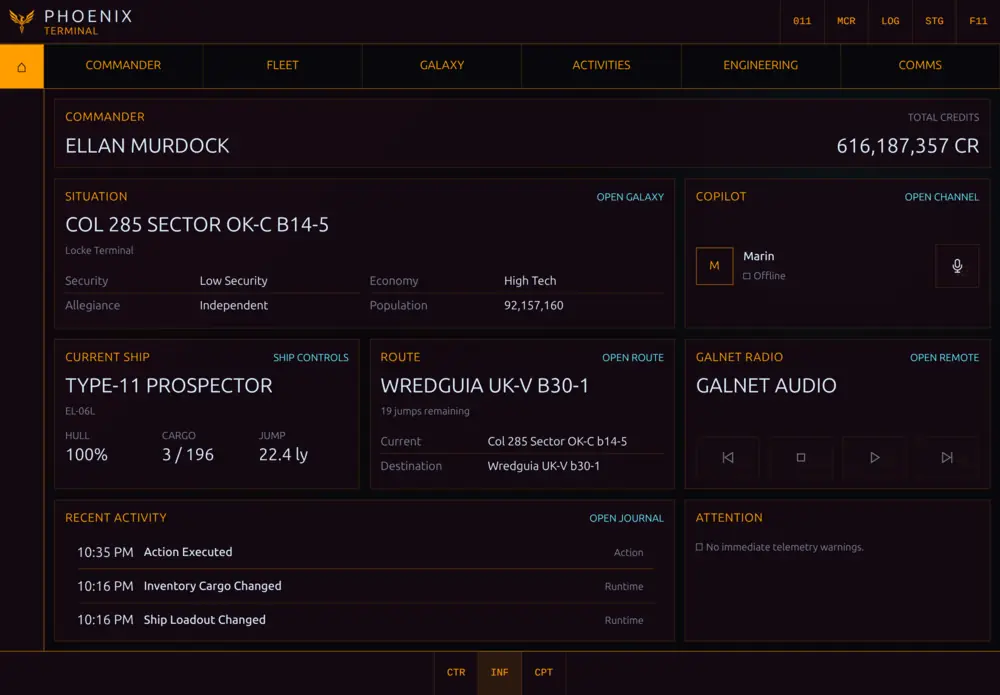

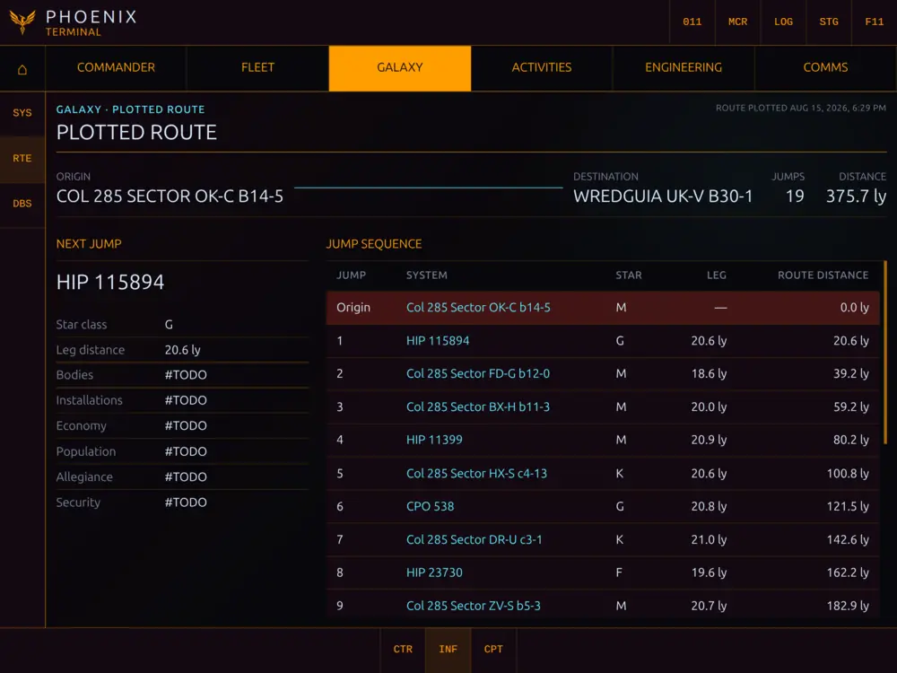

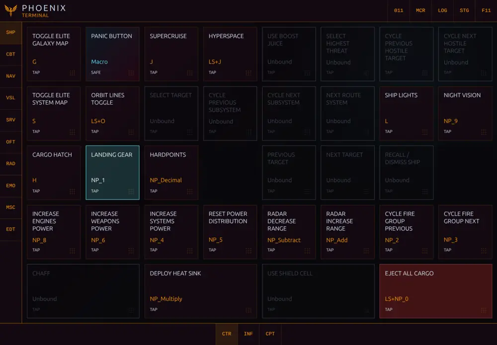

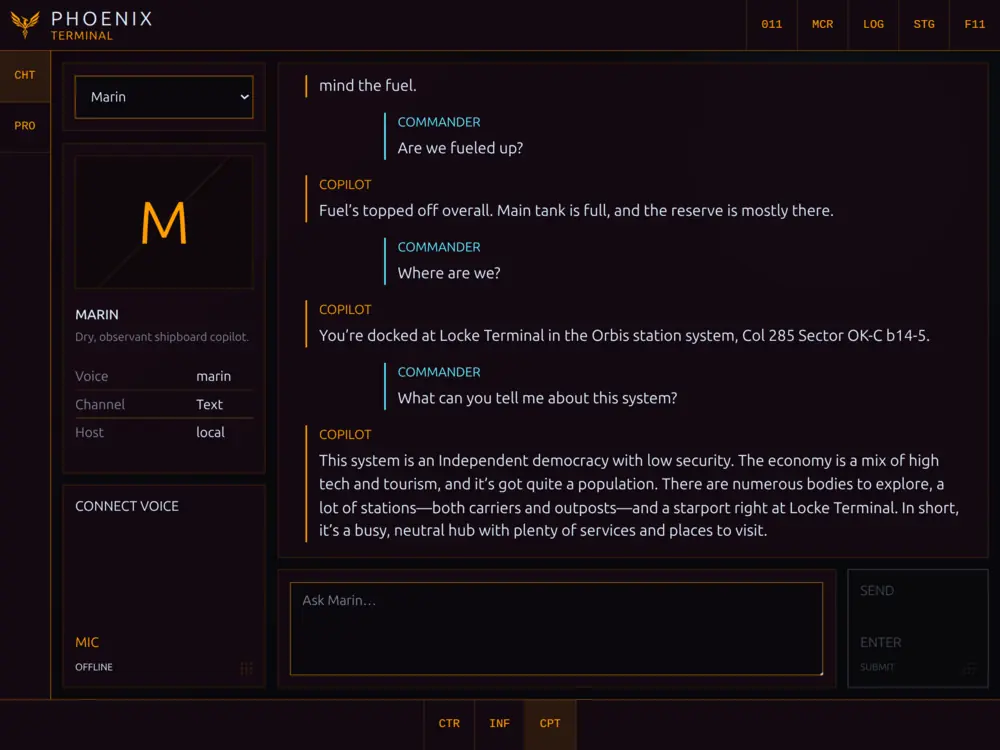

## Current status

PHOENIX runs on **Linux x64 and Windows x64**. Its core game data, controls, galaxy tools, Copilot,
and multi-device cockpit are usable today, but the project remains under active development.

The interface has been optimized primarily for **Chrome on an Android tablet**. Desktop layouts,
other browsers, and other devices still need broader testing.

Some information becomes available only after Elite reports it. PHOENIX labels missing or unknown
data instead of guessing and explains when an action in Elite is required.

## Implemented features

- **Customizable control deck:** remotely control the ship and Elite Dangerous interface using the
  commander's real bindings. Arrange commands freely, record reusable macros, and keep dangerous
  actions visibly distinct.
- **Commander and ship information:** inspect live and reconstructed commander state, ships, fleet,
  cargo, engineering, missions, communications, navigation, exploration, and journal history.
- **Galaxy and cartography tools:** use symbolic system cartography, plotted-route views, and galaxy
  queries for systems, stations, shipyards, outfitting, markets, factions, and community-sourced
  intelligence.
- **Customizable AI Copilot:** create distinct Copilot profiles and converse through persistent text
  chat or realtime voice. The Copilot can query PHOENIX and configured external data sources, reason
  over live commander context, navigate the application across connected displays, and—with
  explicit permission—operate configured controls and macros. It can also just chat, which is
  occasionally safer for everyone involved.
- **Numpad command shortcuts:** assign commands and application destinations to memorable
  Numpad sequences. Navigate PHOENIX or issue controls without hunting through menus, because muscle
  memory is how you survive a pirate ambush.
- **Coordinated multi-device cockpit:** pair browsers, synchronize display commands, choose which
  screen follows Copilot navigation, and coordinate the active voice host without turning every
  connected display into the same screen.

## Installation

**Expect breaking changes and no installation support yet. PHOENIX reports unknown data as unknown
and distinguishes “command sent” from “ship definitely did the thing.”**

Manual installation currently requires Git and Node.js 24.14+.

The first launch requires an internet connection to fetch the upstream game catalogues into local
runtime storage; PHOENIX does not distribute those third-party catalogue snapshots.

### Before the first PHOENIX start

1. Start Elite Dangerous and enter the commander session at least once. For the clearest first-run
   result, leave the game running while PHOENIX starts. This ensures Elite has created its local
   data files and emitted the initial journal, status, and inventory events.
2. In Elite's Controls settings, assign keyboard keys to every game command you want PHOENIX to
   operate, then apply/save the bindings at least once. Controller-only bindings cannot be executed
   by PHOENIX's keyboard input backends.
3. Start PHOENIX after saving the bindings. PHOENIX reads the active `.binds` file at server startup;
   restart PHOENIX after changing bindings in Elite.

PHOENIX can start while Elite is closed, but it cannot display state that Elite has never written
to local files. Journals are local to each computer and are event-driven; they are not a complete
commander database synchronized between installations. Some screens therefore remain explicitly
unsynchronized until Elite emits their snapshot—for example, entering a commander session publishes
the mission manifest, opening Shipyard publishes stored ships, and opening Outfitting publishes
stored modules.

### Windows with PowerShell

Install the required tools from the command line:

```powershell
winget install --id OpenJS.NodeJS.LTS -e --source winget
winget install --id Git.Git -e --source winget
```

Close and reopen PowerShell so the new commands are on `PATH`, then install and start PHOENIX:

```powershell
node --version
npm.cmd --version
git --version

cd $HOME
git clone https://github.com/judus/phoenix.git
cd .\phoenix
npm.cmd install
npm.cmd run build
npm.cmd start
```

Open `http://localhost:3400`. Stop PHOENIX with `Ctrl+C`. To update later:

```powershell
cd $HOME\phoenix
git pull --ff-only
npm.cmd install
npm.cmd run build
npm.cmd start
```

Using `npm.cmd` avoids PowerShell execution-policy problems without changing the machine's policy.
Windows controls send the commander's saved keyboard bindings to the active window, so keep Elite
focused. PHOENIX does not modify Elite or its game files. A backdoor, perhaps—but one with a
manifest, diagnostics, and manners.

### Linux

```sh
git clone https://github.com/judus/phoenix.git
cd phoenix
npm install
npm run build
npm start
```

Update an existing checkout manually:

```sh
git pull --ff-only
npm install
npm run build
npm start
```

Open `http://localhost:3400`. Developers who want the live development servers can instead run:

```sh
npm run dev
```

### Copilot configuration

Copilot is optional and remains disabled when no API key is available. Prefer
`PHOENIX_OPENAI_API_KEY` for an app-specific key. If that variable is absent, PHOENIX falls back to
an existing `OPENAI_API_KEY` inherited from the server process—typically the user's global developer
environment. Users do not need to create or change a global `OPENAI_API_KEY` for PHOENIX, and the
PHOENIX-specific variable takes precedence when both exist. See [`.env.example`](.env.example) for
ports, paths, models, input backends, and other overrides.

## Next steps

1. Add more AI and LLM providers. OpenAI is currently the only supported Copilot provider. PHOENIX
   is not committing to provider exclusivity without a very persuasive sponsorship agreement. 😄
2. Broaden Windows verification across more machines, Elite installations, and control bindings.
3. Continue improving the tablet interface first.
4. Adapt and visually verify the interface for desktop and other auxiliary displays.

## More screenshots

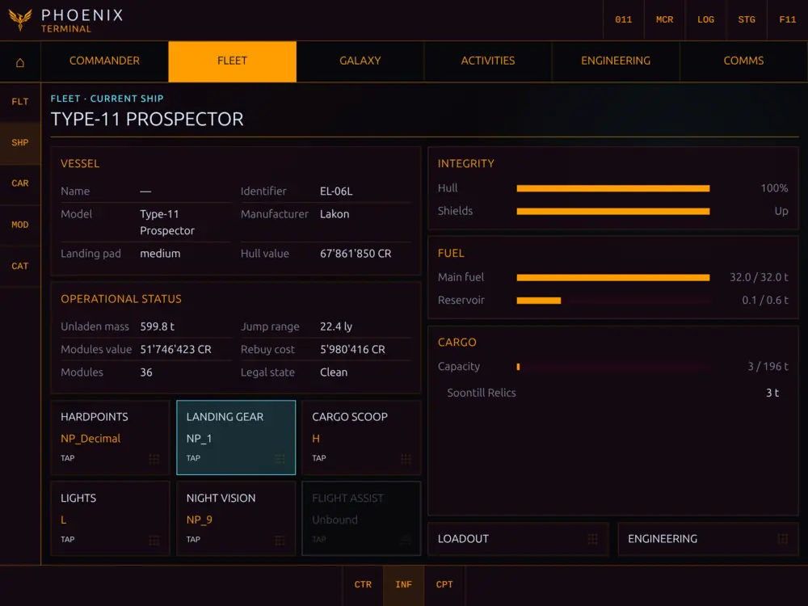
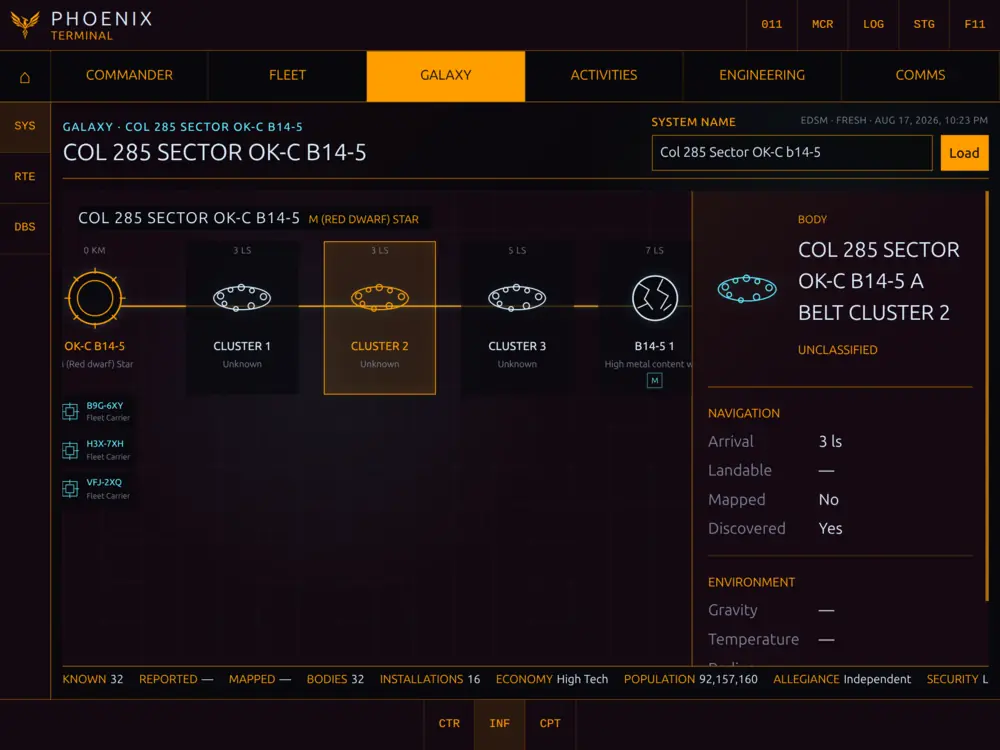
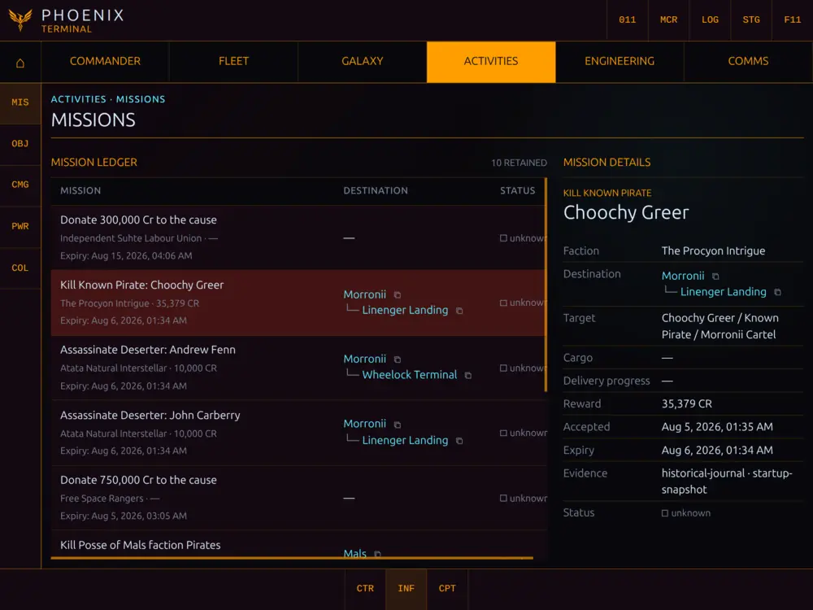
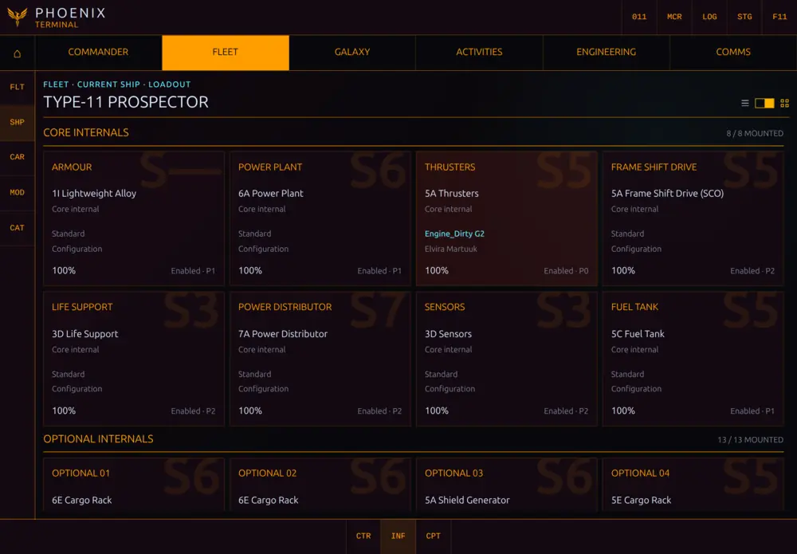
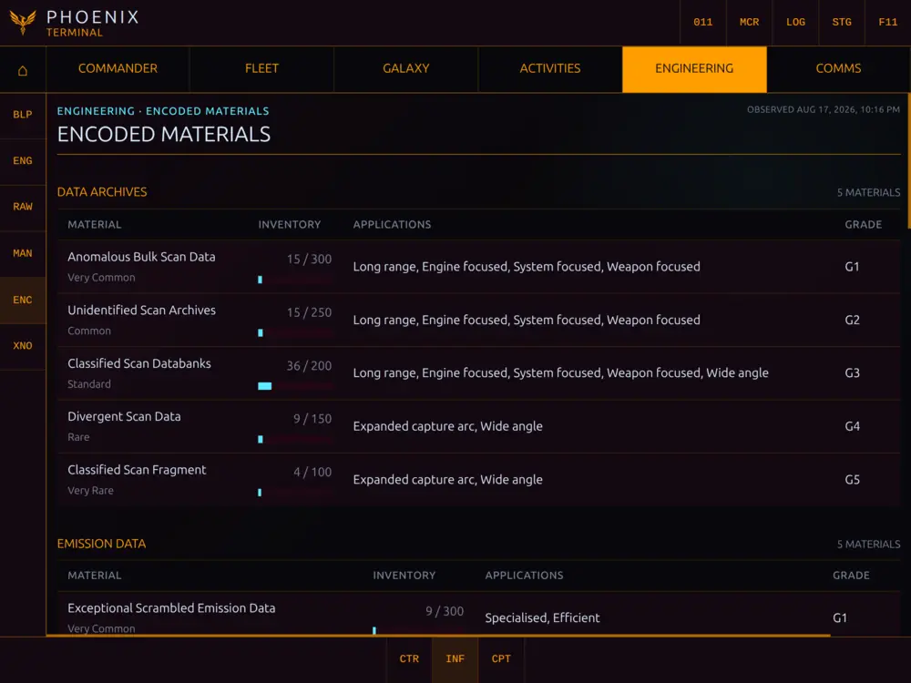
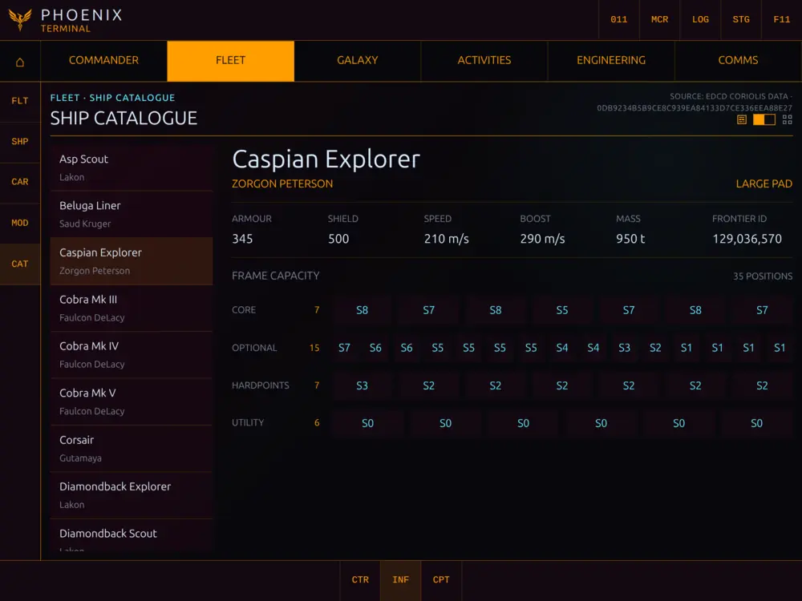
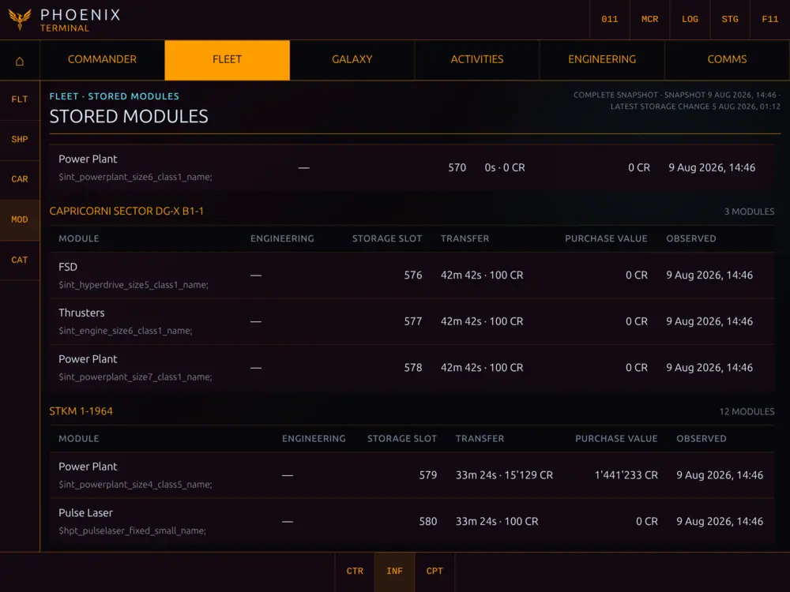
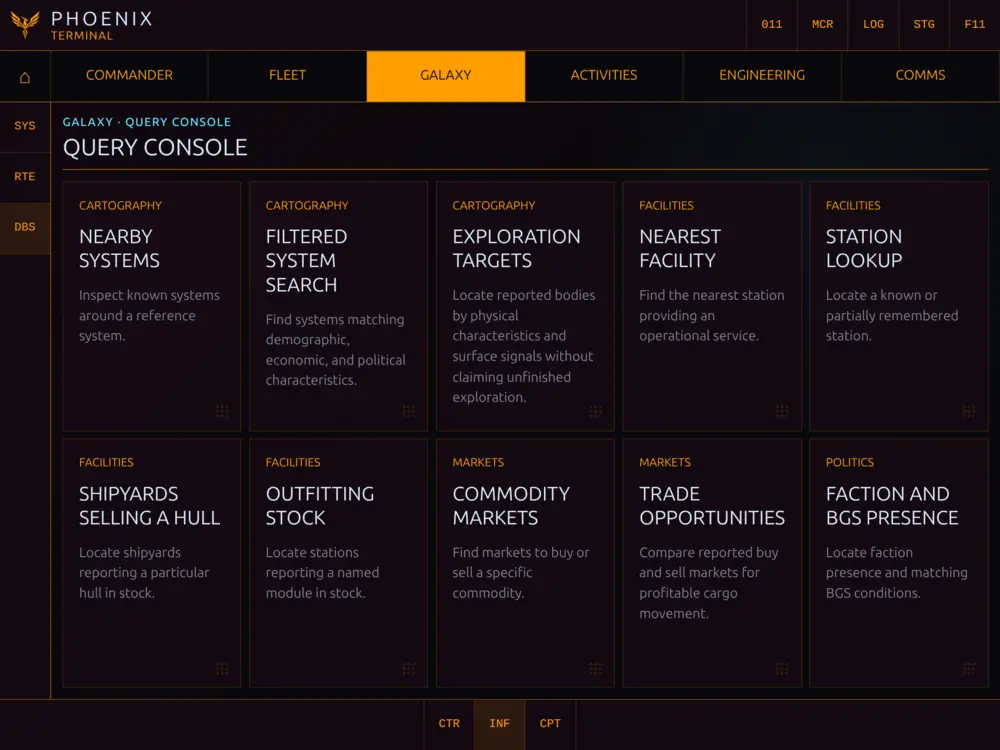
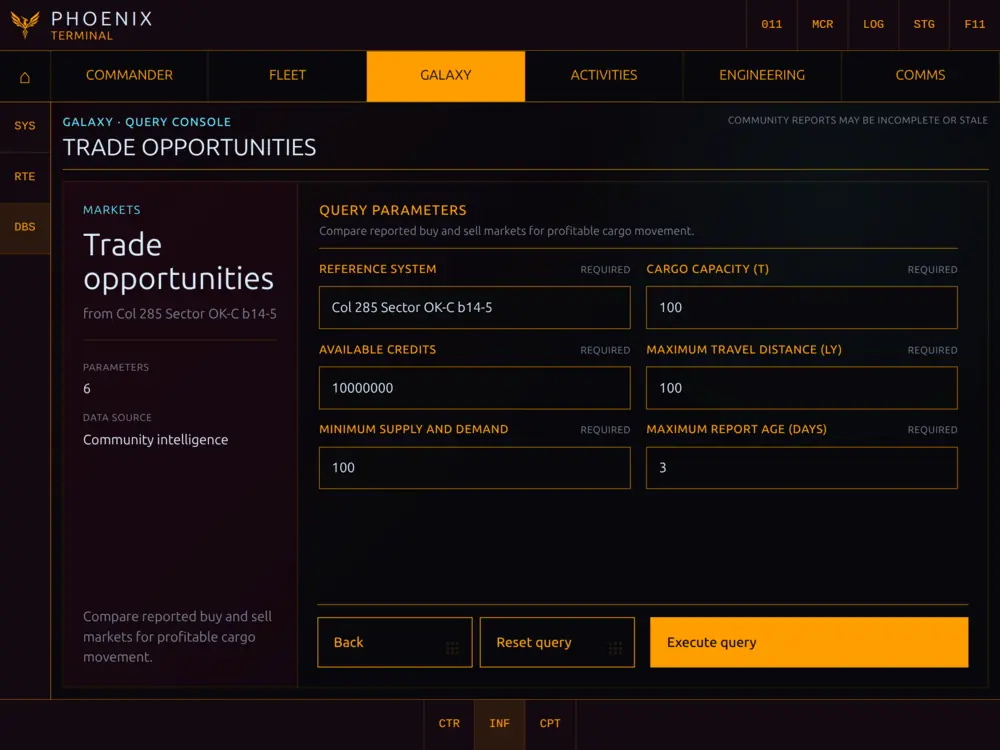
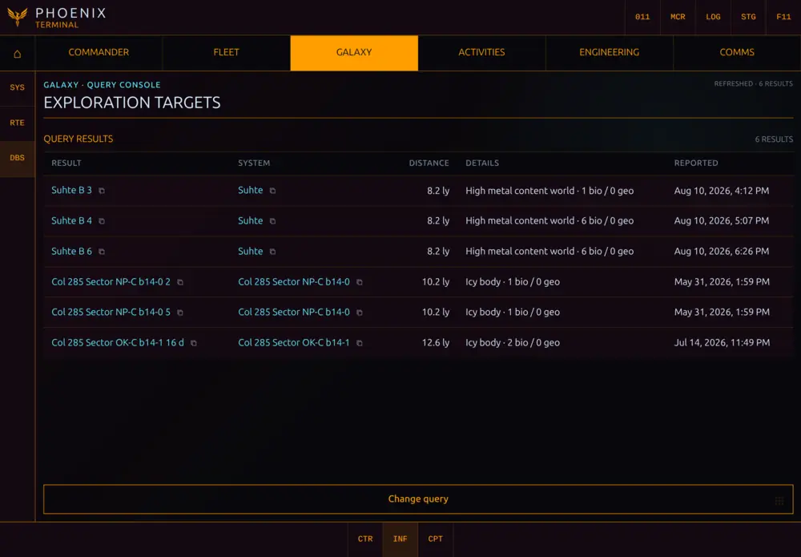

## Feedback and contributions

Bug reports, constructive criticism, and feature requests are very welcome. Feel free to open an
issue—real-world use cases and detailed reports are especially useful. See
[CONTRIB.md](CONTRIB.md) for the current contribution and licensing policy.

PHOENIX is not accepting code contributions or pull requests before its first release. Keeping the
implementation under one maintainer for now helps the code and architecture remain coherent while
the foundations settle. It also leaves room to prioritize the features that matter during actual
gameplay—even if considerably more time is currently spent building the cockpit than flying the
ship.

## License

PHOENIX is source-available under the [PolyForm Strict License 1.0.0](LICENSE). Personal and other
noncommercial use is permitted while redistribution and modified versions are restricted; the
license text itself is authoritative. This deliberately conservative prerelease license may be
relaxed for future versions once the project's long-term distribution model is settled.

The development source remains available for manual installation without charge: users provide
Git and Node.js, manage the checkout and dependencies, and update it with `git pull`. Official
packaged installers may be offered separately as a paid convenience product—potentially through
platforms such as Steam—to provide installation, a bundled runtime, launching, and automatic
updates.
