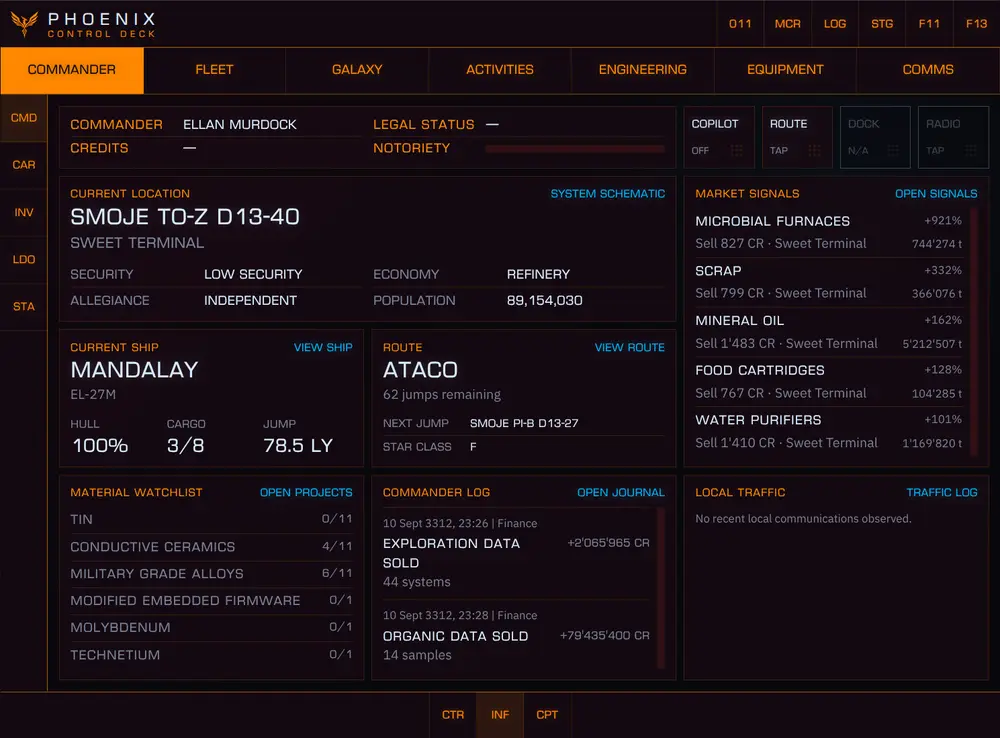
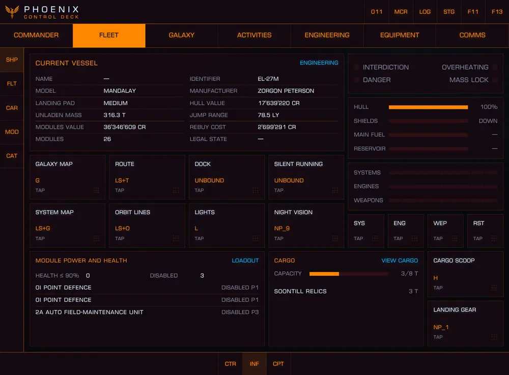
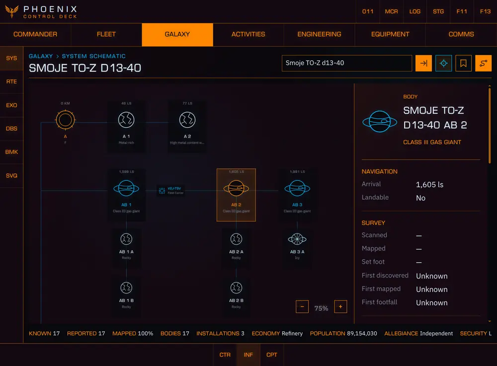
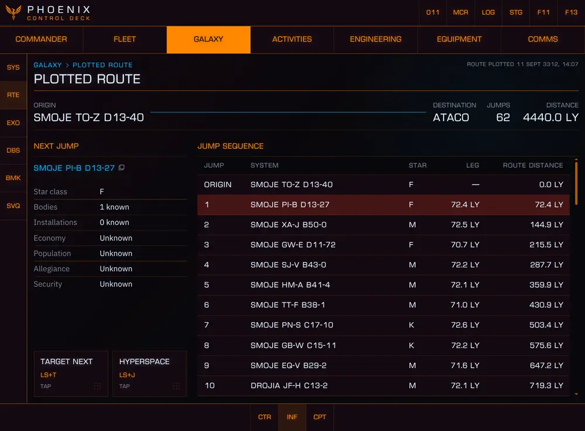
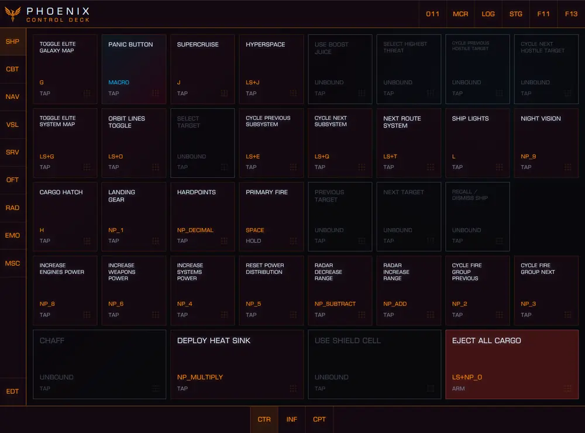
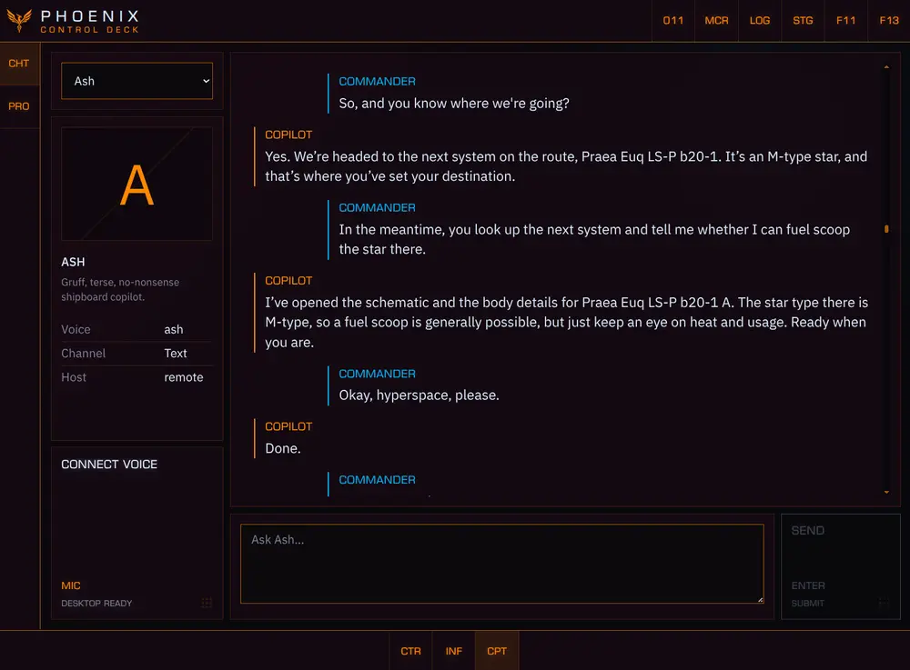

# PHOENIX

> **Active development:** PHOENIX is functional but not finished. Expect rough edges,
> breaking changes, and the occasional suspicious red button.

PHOENIX is a local-first companion application and ship-computer interface for Elite Dangerous. It turns live telemetry, journal history, control bindings, public galaxy data, and an optional AI Copilot into one cockpit for desktop, tablet, and auxiliary displays.














## Current status

PHOENIX runs on **Linux x64 and Windows x64**. Its telemetry, controls, galaxy tools, Copilot,
and multi-device cockpit are usable today, but the project remains under active development.

The interface has been optimized primarily for **Chrome on an Android tablet**. Desktop layouts,
other browsers, and other devices still need broader testing.

## Implemented features

- **Customizable control deck:** remotely control the ship and Elite Dangerous interface using the
  commander's real bindings. Arrange commands freely, record reusable macros, and keep dangerous
  actions visibly distinct.
- **Commander dashboard and records:** keep the current location, ship, plotted route, engineering
  material watchlist, local market signals, notable journal events, and system traffic together.
  Inspect career progress, statistics, personal stores, suit loadouts, missions, objectives, and
  retained journal history when more detail is needed.
- **Fleet and ship operations:** inspect the active ship's telemetry, cargo, modules, engineering,
  power distribution, warnings, and control bindings. Browse stored ships and modules, fleet
  carriers, and the ship catalogue without leaving the cockpit interface.
- **Engineering project planning:** browse blueprints, engineers, and material inventories; build
  multi-step upgrade projects; choose grades and planned rolls; and track stock, requirements, and
  missing materials through the dashboard watchlist.
- **On-foot equipment:** reconstruct observed suits, personal weapons, and loadouts from retained
  journals. Browse upgrade recipes, material requirements, and equipment specialists, and prepare
  suit and weapon upgrade plans.
- **Galaxy, exploration, and market intelligence:** use symbolic system cartography, plotted-route
  and exobiology views, bookmarks, reusable queries, and local market signals. Search systems,
  stations, shipyards, outfitting, commodities, factions, and community-sourced intelligence.
- **Activities and communications:** review missions, objectives, community goals, Powerplay,
  colonisation, local traffic, correspondents, GalNet, and radio from dedicated cockpit sections.
- **Customizable AI Copilot:** create distinct Copilot profiles and converse through persistent text
  chat or realtime voice. The Copilot can query PHOENIX and configured external data sources, reason
  over live commander context, navigate the application across connected displays, and—with
  explicit permission—operate configured controls and macros. It can also just chat, which is
  occasionally safer for everyone involved.
- **Numpad command shortcuts:** assign commands and application destinations to memorable
  Numpad sequences. Navigate PHOENIX or issue controls without hunting through menus, because muscle
  memory is how you survive a pirate ambush.
- **Coordinated multi-device cockpit:** pair browsers, synchronize display commands, choose which
  screen follows Copilot navigation, and coordinate the active voice host without turning every
  connected display into the same screen.
- **Per-display presentation:** select the compact PHOENIX or Elite-inspired presentation, adjust UI
  scale and command-label sizing, enter fullscreen or focused F13 mode, and move between workspaces
  with touch gestures.

## Installation

**PHOENIX is under active development. Expect breaking changes.**

Manual installation currently requires Git and Node.js 24.14+.

The first launch requires an internet connection to fetch the upstream game catalogues into local
runtime storage; PHOENIX does not distribute those third-party catalogue snapshots.

### Before the first PHOENIX start

1. Start Elite Dangerous and enter the commander session at least once. For the clearest first-run
   result, leave the game running while PHOENIX starts. This ensures Elite has created its local
   data files and emitted the initial journal, status, and inventory events.
2. In Elite's Controls settings, assign keyboard keys to every game command you want PHOENIX to
   operate, then apply/save the bindings at least once. Controller-only bindings cannot be executed
   by PHOENIX's keyboard input backends.
3. Start PHOENIX after saving the bindings. PHOENIX reads the active `.binds` file at server startup;
   restart PHOENIX after changing bindings in Elite.

PHOENIX can start while Elite is closed, but it cannot display state that Elite has never written
to local files. Journals are local to each computer and are event-driven; they are not a complete
commander database synchronized between installations. Some screens therefore remain unsynchronized
until Elite emits the relevant snapshot. For example, entering a commander session publishes the
mission manifest, opening Shipyard publishes stored ships, and opening Outfitting publishes stored
modules.

### Windows with PowerShell

Install the required tools from the command line:

```powershell
winget install --id OpenJS.NodeJS.LTS -e --source winget
winget install --id Git.Git -e --source winget
```

Close and reopen PowerShell so the new commands are on `PATH`, then install and start PHOENIX:

```powershell
node --version
npm.cmd --version
git --version

cd $HOME
git clone https://github.com/judus/phoenix.git
cd .\phoenix
npm.cmd install
npm.cmd run build
npm.cmd start
```

Open `http://localhost:3400`. Stop PHOENIX with `Ctrl+C`. To update later:

```powershell
cd $HOME\phoenix
git pull --ff-only
npm.cmd install
npm.cmd run build
npm.cmd start
```

Using `npm.cmd` avoids PowerShell execution-policy problems without changing the machine's policy.
Windows controls send the commander's saved keyboard bindings to the active window, so keep Elite
focused. PHOENIX does not modify Elite or its game files.

### Linux

PHOENIX sends configured keyboard bindings through `xdotool` on X11 and through the XDG
RemoteDesktop portal on Wayland. A source installation therefore needs the input helper for its
desktop session:

- **X11:** `xdotool`
- **Wayland:** `xkbcli` and an XDG RemoteDesktop portal implementation with keyboard support.
  GNOME and KDE installations normally include the appropriate portal backend already.

Install the helpers for both session types if you switch between X11 and Wayland:

```sh
# Debian, Ubuntu, Linux Mint
sudo apt install xdotool libxkbcommon-tools

# Fedora
sudo dnf install xdotool libxkbcommon-utils

# Arch Linux
sudo pacman -S xdotool libxkbcommon
```

On Wayland, PHOENIX asks the desktop for permission when it first sends an input. If controls remain
unavailable, check `data/runtime/system.json`; its `controls.detail` field reports a missing keymap
reader or portal. Install `xdg-desktop-portal` and the matching GNOME or KDE portal backend if the
desktop does not provide one.

```sh
git clone https://github.com/judus/phoenix.git
cd phoenix
npm install
npm run build
npm start
```

Update an existing checkout manually:

```sh
git pull --ff-only
npm install
npm run build
npm start
```

Open `http://localhost:3400`. Developers who want the live development servers can instead run:

```sh
npm run dev
```

### Embedded Control Deck runtime

PHOENIX owns its cockpit UI and consumes only a compiled Control Deck runtime containing the core,
host, keyboard adapter, and Elite Dangerous integration. The versioned tarball lives in
`vendor/control-deck/`; installing PHOENIX does not require access to the private Control Deck
repository, GitHub credentials, or a package registry.

To update it, run `npm run package:phoenix` in the Control Deck repository, replace the versioned
tarball, update the three `control-deck` file dependencies in PHOENIX, and run `npm install` followed
by `npm run check`. Do not add Control Deck UI or standalone-product exports to this artifact.

### Copilot configuration

Copilot is optional and remains disabled when no API key is available. Use
`PHOENIX_OPENAI_API_KEY` for an app-specific key; if unset, PHOENIX falls back to `OPENAI_API_KEY`
from the server environment. The PHOENIX-specific variable takes precedence. See
[`.env.example`](.env.example) for ports, paths, models, input backends, and other overrides.
OpenAI wire logging is disabled by default because it can contain prompts, responses, and tool data.
The same configured API key enables the Copilot's bounded public-web search tool for typed and
realtime voice conversations. `PHOENIX_OPENAI_WEB_SEARCH_MODEL` can select a separate Responses API
model for those searches; it defaults to `PHOENIX_OPENAI_MODEL`.
PHOENIX restricts its user-state directories and files to `0700` and `0600` on POSIX systems. On
Windows, keep custom state/log paths inside a user-profile directory with an equivalent private ACL.

Realtime voice requires PHOENIX to remain open in a browser on the computer running the server.
Open it through `http://localhost:3400`, connect voice once, allow microphone access, then return
focus to Elite while keeping the browser open. Paired auxiliary displays can control that voice
host over the network; for practical cockpit use, Realtime voice therefore requires at least one
auxiliary display. Select the intended microphone and output under Voice audio, avoid Stereo Mix or
other loopback inputs, and use headphones if speaker bleed would make Copilot respond to game audio.

## Next steps

1. Add more Copilot providers. OpenAI is currently the only supported provider. PHOENIX is not
   committing to provider exclusivity without a very persuasive sponsorship agreement.
2. Broaden Windows verification across more machines, Elite installations, and control bindings.
3. Continue improving the tablet interface first.
4. Adapt and visually verify the interface for desktop and other auxiliary displays.

## Feedback and contributions

Bug reports, constructive criticism, and feature requests are very welcome. Feel free to open an
issue—real-world use cases and detailed reports are especially useful. See
[CONTRIB.md](CONTRIB.md) for the current contribution and licensing policy.

Code contributions are welcome. Please discuss substantial product or architectural changes before
investing in an implementation, preserve the package boundaries described in the contribution
guide, and include focused validation with behavioral changes.

## License

PHOENIX source code and documentation are open source under the [Apache License 2.0](LICENSE).
Copyright and attribution notices must be retained as required by the licence and [NOTICE](NOTICE).

Official distributions include a purpose-built, separately licensed Control Deck runtime. That
unmodified runtime may accompany PHOENIX and genuine PHOENIX derivatives distributed without
charge; payment may not be required for access, features, or updates. Voluntary donations and
sponsorship not tied to access remain permitted. See [Third-party notices](THIRD_PARTY_NOTICES.md)
and the runtime licence included with the package for the complete boundary.

## Screenshots


