# PHOENIX

An Elite Dangerous companion for your desktop, tablet, or spare screen. Check your ship and
materials, plan engineering, find your next stop, and build a panel of buttons for the things
you actually use while playing. There’s an optional AI Copilot, too.

PHOENIX runs on your gaming computer and reads Elite’s journals and status files. Open it in a
browser on that computer, or pair a tablet over your local network.

> Still under active development. Expect rough edges, breaking changes, and the occasional
> suspicious red button. Back up your PHOENIX data before upgrading.

## Download

Download the pre-release installer:

- Windows installer: [PHOENIX-windows-x64-setup.exe](https://github.com/judus/phoenix/releases/download/v0.1.7/PHOENIX-windows-x64-setup.exe)
- AppImage for Linux: [PHOENIX-linux-x64.AppImage](https://github.com/judus/phoenix/releases/download/v0.1.7/PHOENIX-linux-x64.AppImage)

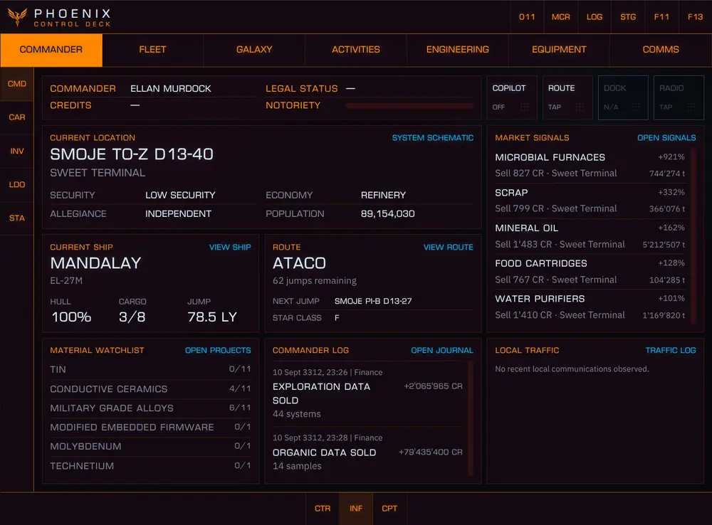

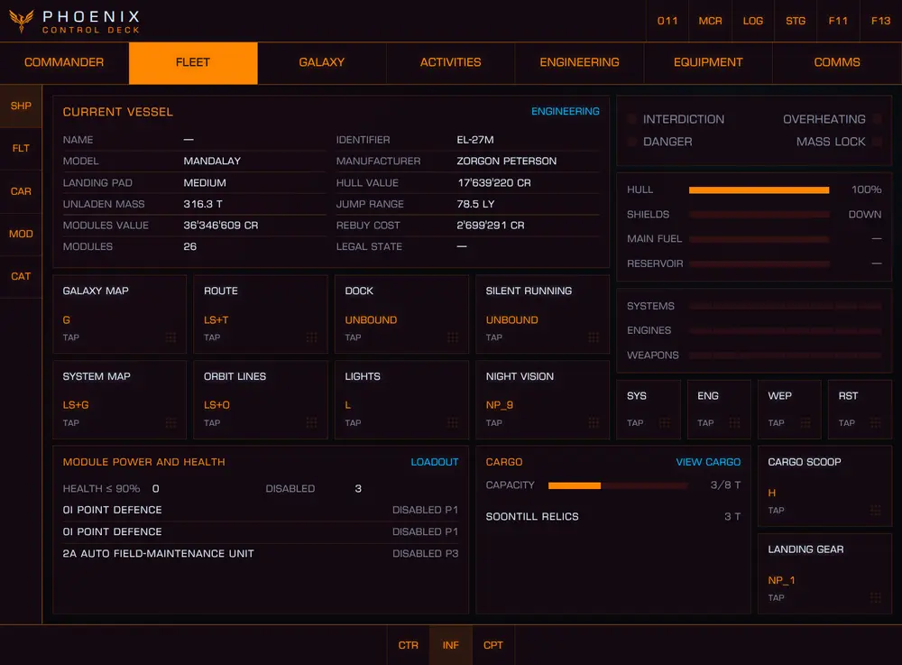

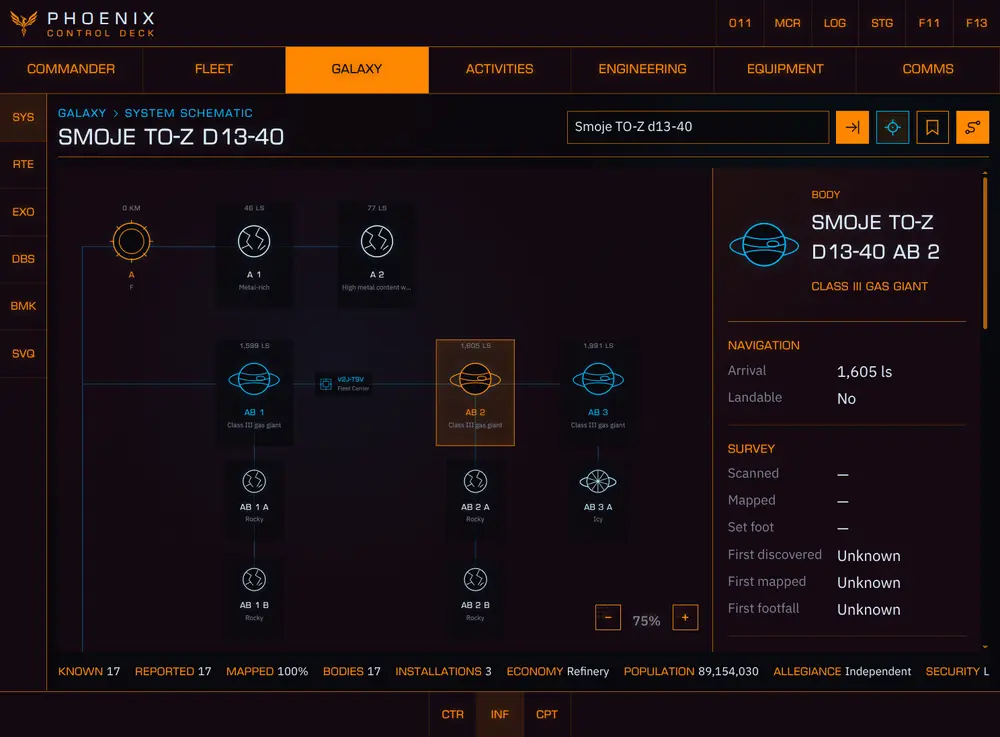

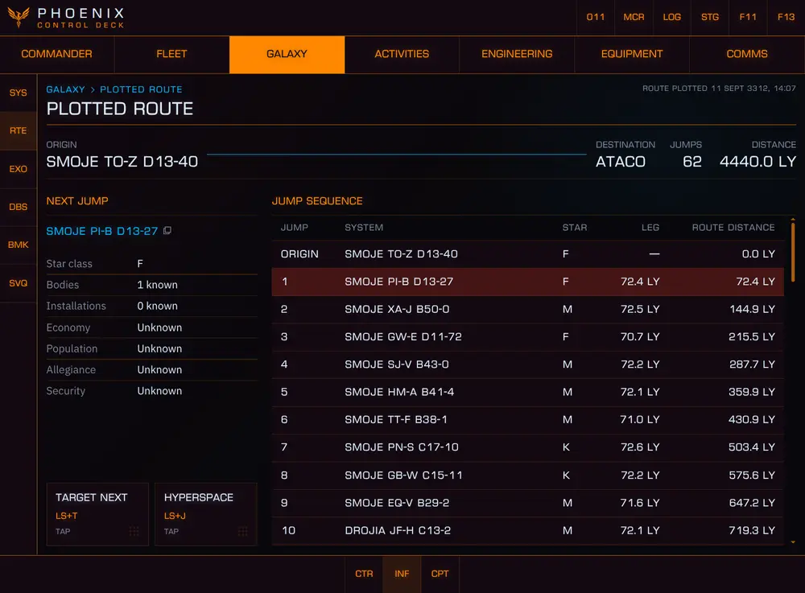

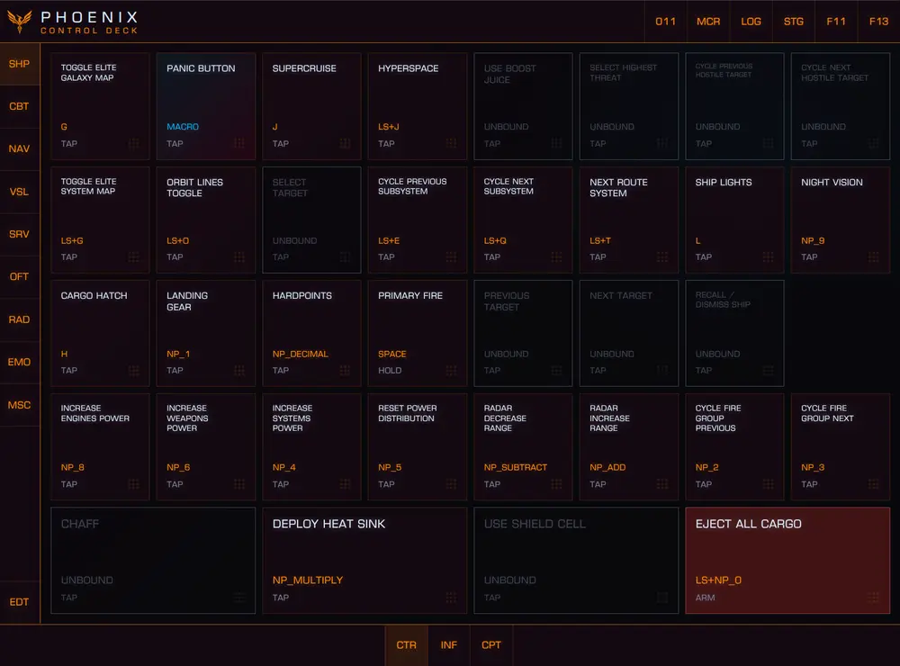

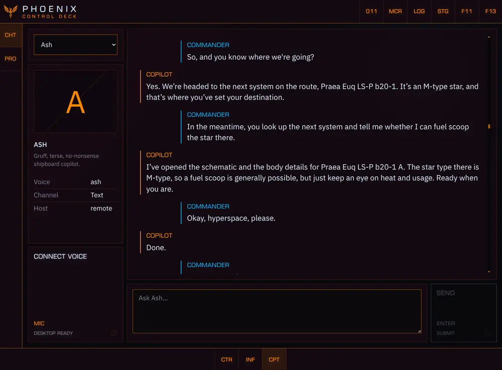

## What it can do

- **Control decks and shortcuts.** Arrange buttons for Elite commands, record macros, and use
  your saved keyboard bindings. Mix game controls with links to pages, saved searches, and
  bookmarks in a Quick access deck. Numpad sequences give you another way to reach them.
  Create, reorder and resize your own decks, and drag buttons to move or swap them.
- **Commander dashboard and log.** See your location, ship, route, material watchlist, market
  signals, and local traffic. Browse gameplay events, career progress, statistics, and missions.
- **Ships and modules.** Check the current ship’s status, cargo, warnings, modules, and engineering.
  Browse your stored ships and modules, carrier information, and the ship catalogue.
- **Engineering plans.** Look up blueprints and experimental effects, choose grades and planned
  rolls, and see the materials you have and still need. Track several upgrades in one project.
- **On-foot equipment.** Browse observed suits, weapons, and loadouts, along with upgrade recipes,
  modifications, materials, and specialists. Preview the cost of a suit or weapon upgrade plan.
- **System schematics and galactic atlas.** Explore the current system, follow a plotted route,
  hide fleet carriers, or zoom out to see the galactic regions and your position in the galaxy.
  Tilt the Atlas into a schematic 3D view with location heights above the galactic plane.
- **Personal notes.** Keep short reminders in the NTS workspace, optionally linked to a mission,
  system, station or body. Read them on cards, edit them yourself, or let Copilot save and retrieve
  them when explicitly asked and allowed.
- **Searches for your next stop.** Find stations, ships, modules, commodities, exploration targets,
  and faction states. Look for a raw, manufactured, or encoded Material Trader—or Vista Genomics.
  Use name suggestions, bookmark systems and stations, and save searches that follow your current
  system instead of a fixed location.
- **Activities and news.** Check missions, objectives, community goals, Powerplay, colonisation,
  GalNet, and radio without leaving PHOENIX. Optional GalNet analysis connects reports and
  investigation leads with the Atlas and Copilot; background analysis is off until enabled.
- **Optional Copilot.** Chat by text or realtime voice, with separate profiles and conversation
  history. Let it look things up, open pages on your screens, or use controls and macros you’ve
  explicitly allowed. It can also just chat, which is occasionally safer for everyone involved.
- **A setup for each screen.** Pair multiple browsers without making them all show the same page.
  Choose the compact PHOENIX or Elite-inspired theme, adjust the scale, use fullscreen or the
  chrome-free F13 focus view, and switch workspaces with touch gestures.
- **Desktop tray.** Open PHOENIX, pair another device, or quit the background app from the tray on
  Windows and supported Linux desktops. The Linux tray also provides access to logs.

## Getting started

1. Launch Elite and enter your commander session at least once, so it creates the journal and
   status files PHOENIX reads.
2. Assign keyboard bindings in Elite for the commands you want PHOENIX to control, then save them.
   Controller-only bindings aren’t enough. Restart PHOENIX after changing Elite’s bindings.
3. Install and launch PHOENIX. On Linux, mark the AppImage executable first:

   ```sh
   chmod +x PHOENIX-linux-x64.AppImage
   ./PHOENIX-linux-x64.AppImage
   ```

4. Your browser opens automatically. If needed, open `http://localhost:3400` yourself.
5. To add a tablet or another screen, choose **Pair device** from the tray and scan the QR code.
   Keep both devices on the same local network.

Closing the browser doesn’t stop PHOENIX. Use **Quit** in the tray. If your Linux desktop has no
tray host, run the AppImage with `--stop`.

Keep Elite focused when sending controls. On Wayland, the desktop will ask permission to send
keyboard input. Online searches, catalogue refreshes, and Copilot need an internet connection.

### Copilot setup

Copilot is optional. It currently uses OpenAI and needs your own API key; API usage may cost money.
Set `PHOENIX_OPENAI_API_KEY` in the environment used to start PHOENIX, or use `OPENAI_API_KEY`
as a fallback. See the [setup guide](docs/installation.md#copilot) for details.

For realtime voice, keep PHOENIX open at `http://localhost:3400` on the gaming computer, allow
microphone access, then return focus to Elite. A paired tablet can control that voice session.

## Things to know

- The interface is mainly tested in Chrome on an Android tablet. Other browsers and screen sizes
  need more testing.
- Journals aren’t a complete, live inventory of everything you own. Some information updates only
  after you enter the game or open a relevant screen, such as Shipyard or Outfitting. On-foot gear
  is reconstructed from the journals PHOENIX has seen.
- Community search results can be old. Reported market stock isn’t a guarantee it will still be
  there when you arrive.
- EDDN submission support and a submission log are implemented, but **production uploads are
  not enabled yet**. Don’t rely on PHOENIX as your EDDN uploader for now.

## Development and feedback

Bug reports, ideas, and contributions are welcome. [Open an issue](https://github.com/judus/phoenix/issues)
and tell us what happened—or what would make PHOENIX more useful during a session. Don’t include
API keys, pairing codes, or private journal data.

For code changes, start with [the contribution guide](CONTRIB.md). Please discuss big changes
before spending a weekend implementing them.

- [Source installation and Copilot setup](docs/installation.md)
- [Building and testing installers](scripts/package/README.md)
- [Experimental Android shell — local APK build](apps/android/README.md)
- [Branches, CI, and releases](docs/releases.md)
- [Environment options](.env.example)

Development happens on `dev`; releases come from `main`. More Copilot providers, broader desktop
and Windows testing, and continued tablet improvements are on the list.

## License

PHOENIX’s source and documentation use the [Apache License 2.0](LICENSE); retain the required
[copyright notices](NOTICE).

The included Control Deck runtime has a separate licence. It may be shipped unmodified with
free PHOENIX distributions and derivatives; charging for access, features, or updates requires
separate permission. Voluntary donations are welcome. See [third-party notices](THIRD_PARTY_NOTICES.md)
and the runtime’s included licence for the full terms.

PHOENIX is an unofficial companion, not affiliated with Frontier Developments.

## Screenshots

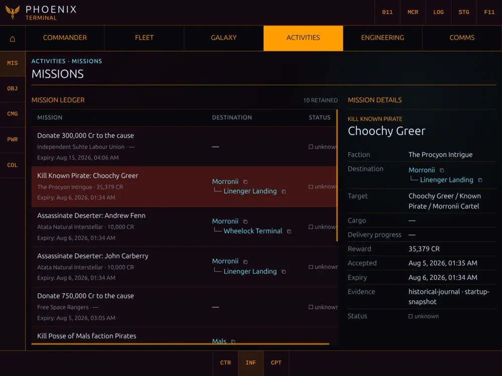
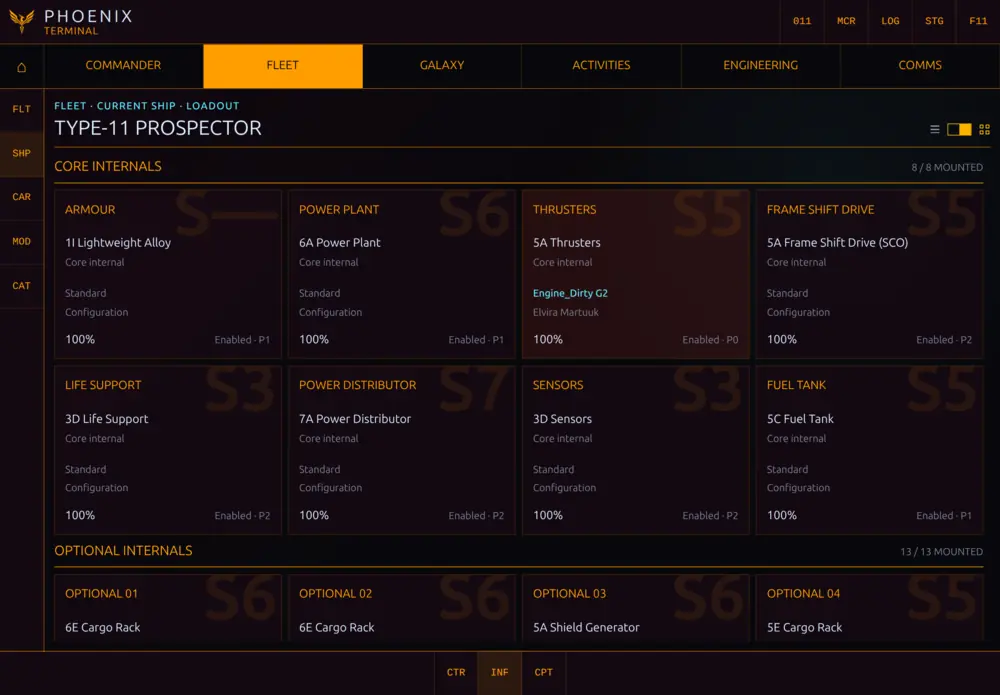
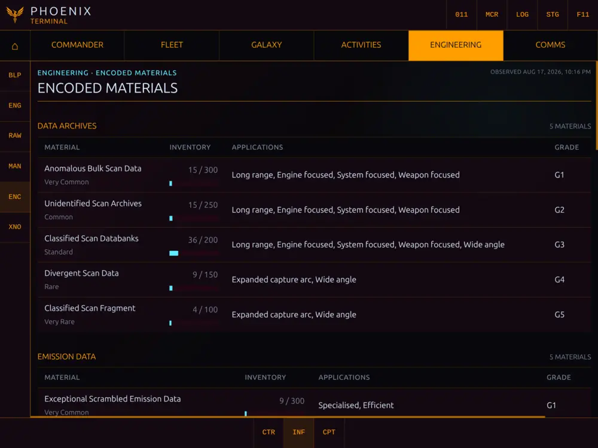
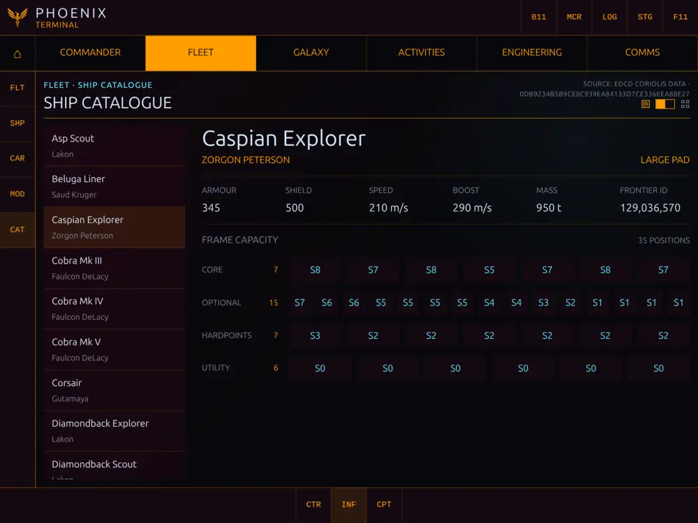
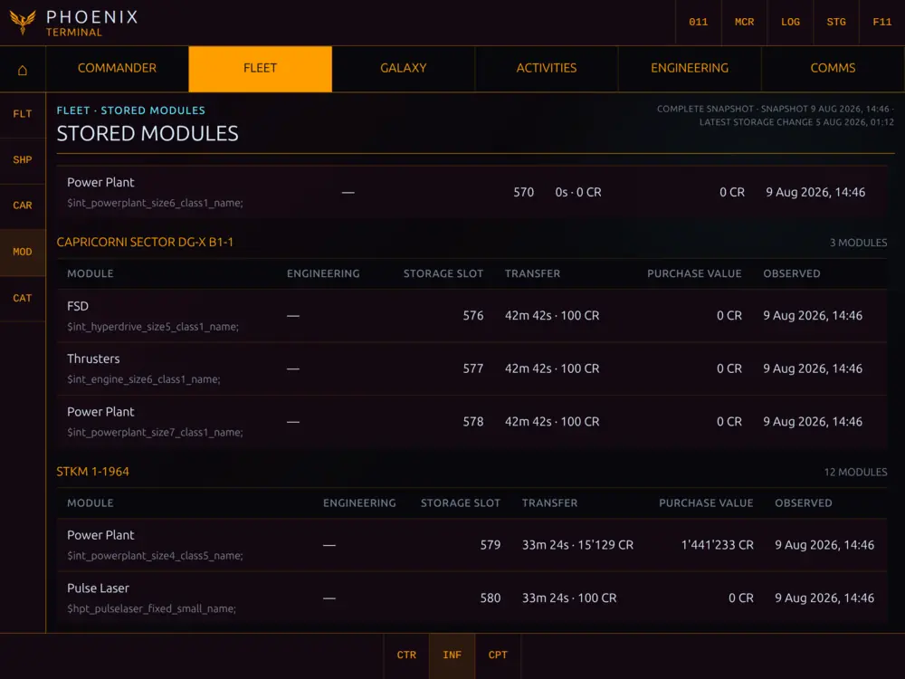
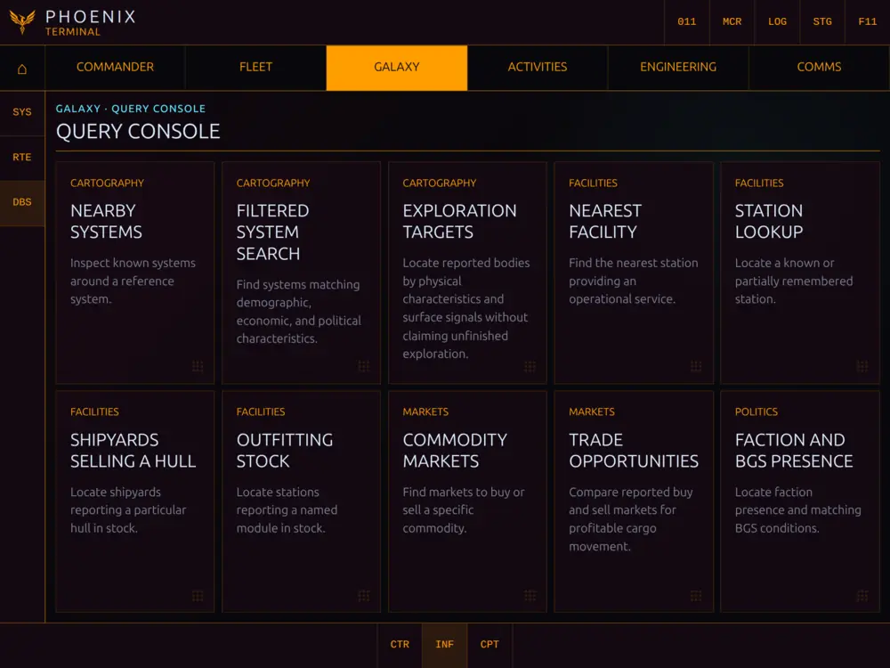
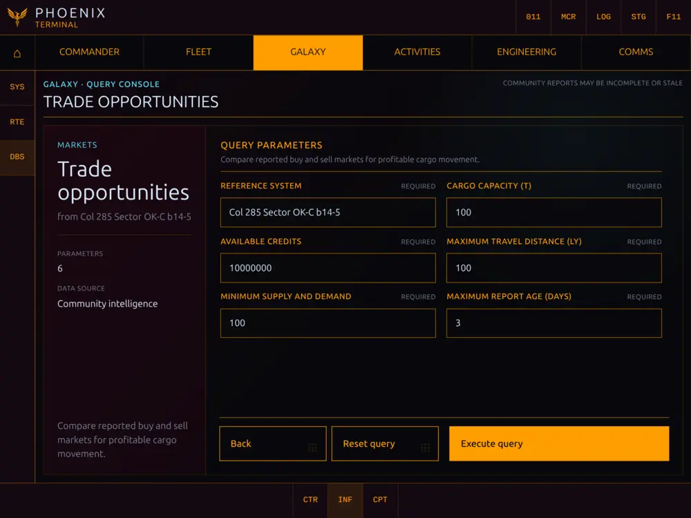
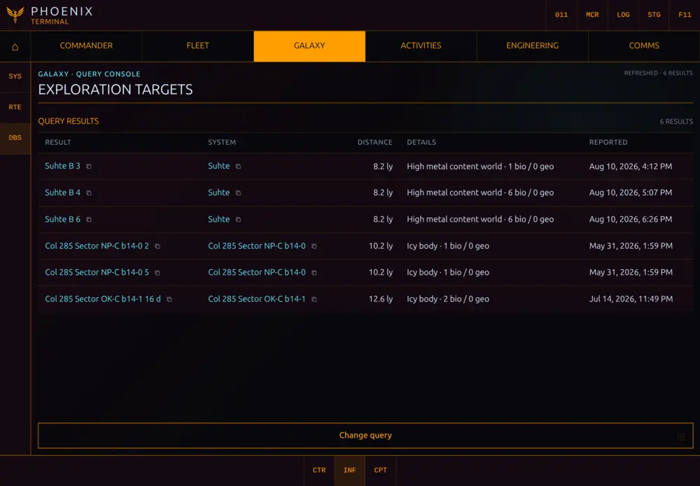
